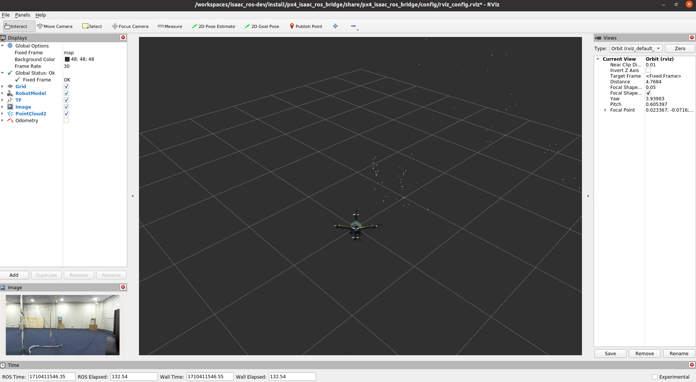
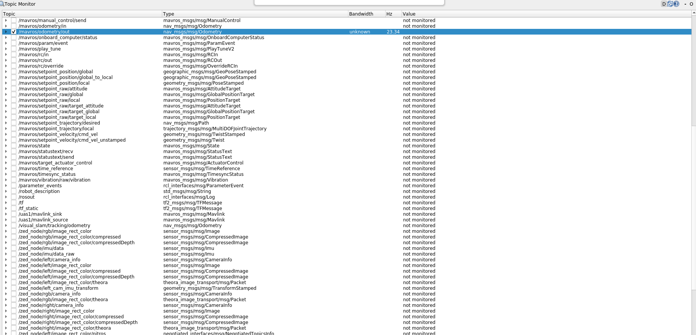
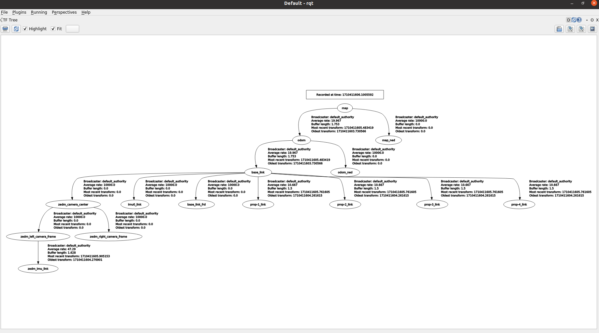

# Visual-Slam with Jetson-Orin-Nano and PX4


### System Setup

- Jetson Orin Nano 8GB Devkit (Jetpack 5.1.3)
- Holybro Pixhawk 6C Mini (px4 v1.14 firmware)
- Zedm camera 

### Start
**1. Clone the Repository:**
```
git clone https://github.com/UoSM-CIRG/VSlam-Jetson-Orin-PX4.git
git submodule update --init --recursive
```

**2. Update Environment (replace with your actual workspace):**

Add these lines to your ~/.bashrc file
```
export ISAAC_ROS_WS=/home/nvidia/workspaces/VSlam-Jetson-Orin-PX4/
alias isaac_ros_container="${ISAAC_ROS_WS}/src/isaac_ros_common/scripts/run_dev.sh ${ISAAC_ROS_WS}"
```

**3. Build docker image**

Build the docker image and start the container with
```
isaac_ros_container
```
**4. Build ros packages**

Once inside the container, build the ros packages with
```
colcon build --symlink-install
```
**5. Launch px4 bridge**

In the same terminal, source the newly build ros packages and run the px4_isaac_ros_bridge.
This will remap the odmotry topic from isaac_ros_visual_slam for mavros px4.
```
source install/setup.sh
ros2 launch px4_isaac_ros_bridge px4_isaac_ros_bridge.launch.py
```

**6. Launch isaac visual slam with zed wrapper**

In another terminal, launch the container and proceed to launch the isaac_ros node with zedm camera
```
isaac_ros_container
source install/setup.sh
ros2 launch isaac_ros_visual_slam isaac_ros_visual_slam_zedm.launch.py
```

You should be able to view the following output





### Reference

- [Isaac ROS getting started](https://nvidia-isaac-ros.github.io/getting_started/isaac_ros_buildfarm_cdn.html#setup)
- [Isaac ROS common docker environment](https://nvidia-isaac-ros.github.io/repositories_and_packages/isaac_ros_common/index.html#isaac-ros-docker-development-environment)
- [Isaac ROS with Zed Tutorial](https://nvidia-isaac-ros.github.io/concepts/visual_slam/cuvslam/tutorial_zed.html)
- [PX4 External Position Estimation](https://docs.px4.io/main/en/ros/external_position_estimation.html)
- [ROS Coordinate Frames for Mobile Platforms](https://ros.org/reps/rep-0105.html)

### Common issue

1. Disable X11 forwarding at /etc/ssh/sshd_config connecting jetson orin remotely via remote ssh.

2. Check cable/usb connection with `sudo dmesg -wH` or restart docker with `systemctl restart docker.service` if zed camera fail to open.

3. Low /mavros/odometry/out topic publishing rate (not sure where could be the bottleneck), thing that you can try
- Reducing resolution and increasing the publishing rate of zed camera
- Disable the ros debug related application such as rviz and rqt 
- Runinng localization only or disable mapping. 
